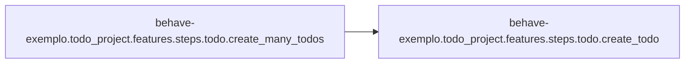

# Behave-exemplo Todo Project

[_Documentation generated by Documatic_](https://www.documatic.com)

<!---Documatic-section-Codebase Structure-start--->
## Codebase Structure

<!---Documatic-block-system_architecture-start--->
```mermaid
None
```
<!---Documatic-block-system_architecture-end--->

# #
<!---Documatic-section-Codebase Structure-end--->

<!---Documatic-section-behave_exemplo.todo_project.features.environment.before_all-start--->
## behave-exemplo.todo_project.features.environment.before_all

<!---Documatic-section-before_all-start--->
<!---Documatic-block-behave_exemplo.todo_project.features.environment.before_all-start--->
<details>
	<summary><code>behave_exemplo.todo_project.features.environment.before_all</code> code snippet</summary>

```python
def before_all(context):
    browser = context.config.userdata.get('browser')
    browsers = {'chrome': Chrome, 'firefox': Firefox}
    context.browser = browsers[browser]()
```
</details>
<!---Documatic-block-behave_exemplo.todo_project.features.environment.before_all-end--->
<!---Documatic-section-before_all-end--->

# #
<!---Documatic-section-behave_exemplo.todo_project.features.environment.before_all-end--->

<!---Documatic-section-behave_exemplo.todo_project.features.environment.after_all-start--->
## behave-exemplo.todo_project.features.environment.after_all

<!---Documatic-section-after_all-start--->
<!---Documatic-block-behave_exemplo.todo_project.features.environment.after_all-start--->
<details>
	<summary><code>behave_exemplo.todo_project.features.environment.after_all</code> code snippet</summary>

```python
def after_all(context):
    context.browser.quit()
```
</details>
<!---Documatic-block-behave_exemplo.todo_project.features.environment.after_all-end--->
<!---Documatic-section-after_all-end--->

# #
<!---Documatic-section-behave_exemplo.todo_project.features.environment.after_all-end--->

<!---Documatic-section-behave_exemplo.todo_project.features.environment.after_step-start--->
## behave-exemplo.todo_project.features.environment.after_step

<!---Documatic-section-after_step-start--->
<!---Documatic-block-behave_exemplo.todo_project.features.environment.after_step-start--->
<details>
	<summary><code>behave_exemplo.todo_project.features.environment.after_step</code> code snippet</summary>

```python
def after_step(context, step):
    if context.config.userdata.getbool('debug') and step.status == 'failed':
        spost_mortem(step.exc_traceback)
```
</details>
<!---Documatic-block-behave_exemplo.todo_project.features.environment.after_step-end--->
<!---Documatic-section-after_step-end--->

# #
<!---Documatic-section-behave_exemplo.todo_project.features.environment.after_step-end--->

<!---Documatic-section-behave_exemplo.todo_project.features.steps.todo.go_to_page-start--->
## behave-exemplo.todo_project.features.steps.todo.go_to_page

<!---Documatic-section-go_to_page-start--->
<!---Documatic-block-behave_exemplo.todo_project.features.steps.todo.go_to_page-start--->
<details>
	<summary><code>behave_exemplo.todo_project.features.steps.todo.go_to_page</code> code snippet</summary>

```python
@given('que eu esteja na página {page}')
def go_to_page(context, page):
    context.page = PageTodo(context.browser, 'http://selenium.dunossauro.live/todo_list.html')
    context.page.open()
```
</details>
<!---Documatic-block-behave_exemplo.todo_project.features.steps.todo.go_to_page-end--->
<!---Documatic-section-go_to_page-end--->

# #
<!---Documatic-section-behave_exemplo.todo_project.features.steps.todo.go_to_page-end--->

<!---Documatic-section-behave_exemplo.todo_project.features.steps.todo.create_todo-start--->
## behave-exemplo.todo_project.features.steps.todo.create_todo

<!---Documatic-section-create_todo-start--->
<!---Documatic-block-behave_exemplo.todo_project.features.steps.todo.create_todo-start--->
<details>
	<summary><code>behave_exemplo.todo_project.features.steps.todo.create_todo</code> code snippet</summary>

```python
@when('criar um todo')
def create_todo(context):
    texto_do_step = loads(context.text)
    context.page.todo.create_todo(name=texto_do_step['nome'], description=texto_do_step['descrição'])
```
</details>
<!---Documatic-block-behave_exemplo.todo_project.features.steps.todo.create_todo-end--->
<!---Documatic-section-create_todo-end--->

# #
<!---Documatic-section-behave_exemplo.todo_project.features.steps.todo.create_todo-end--->

<!---Documatic-section-behave_exemplo.todo_project.features.steps.todo.create_many_todos-start--->
## behave-exemplo.todo_project.features.steps.todo.create_many_todos

<!---Documatic-section-create_many_todos-start--->


### Object Calls

* behave-exemplo.todo_project.features.steps.todo.create_todo

<!---Documatic-block-behave_exemplo.todo_project.features.steps.todo.create_many_todos-start--->
<details>
	<summary><code>behave_exemplo.todo_project.features.steps.todo.create_many_todos</code> code snippet</summary>

```python
@when('criar os seguintes todos')
def create_many_todos(context):
    for linha in context.table.rows:
        linha_convertida = dict(linha.items())
        urgent = False
        if linha_convertida.get('urgente'):
            urgent = True if linha_convertida['urgente'] == 'sim' else False
        context.page.todo.create_todo(name=linha_convertida['nome'], description=linha_convertida['descrição'], urgent=urgent)
```
</details>
<!---Documatic-block-behave_exemplo.todo_project.features.steps.todo.create_many_todos-end--->
<!---Documatic-section-create_many_todos-end--->

# #
<!---Documatic-section-behave_exemplo.todo_project.features.steps.todo.create_many_todos-end--->

<!---Documatic-section-behave_exemplo.todo_project.features.steps.todo.check_todo-start--->
## behave-exemplo.todo_project.features.steps.todo.check_todo

<!---Documatic-section-check_todo-start--->
<!---Documatic-block-behave_exemplo.todo_project.features.steps.todo.check_todo-start--->
<details>
	<summary><code>behave_exemplo.todo_project.features.steps.todo.check_todo</code> code snippet</summary>

```python
@then('o todo deve estar na pilha "{elemento}"')
def check_todo(context, elemento):
    elemento = elemento.lower().replace(' ', '_')
    page_element = getattr(context.page, elemento)
    assert 1 == len(page_element.todos)
```
</details>
<!---Documatic-block-behave_exemplo.todo_project.features.steps.todo.check_todo-end--->
<!---Documatic-section-check_todo-end--->

# #
<!---Documatic-section-behave_exemplo.todo_project.features.steps.todo.check_todo-end--->

[_Documentation generated by Documatic_](https://www.documatic.com)